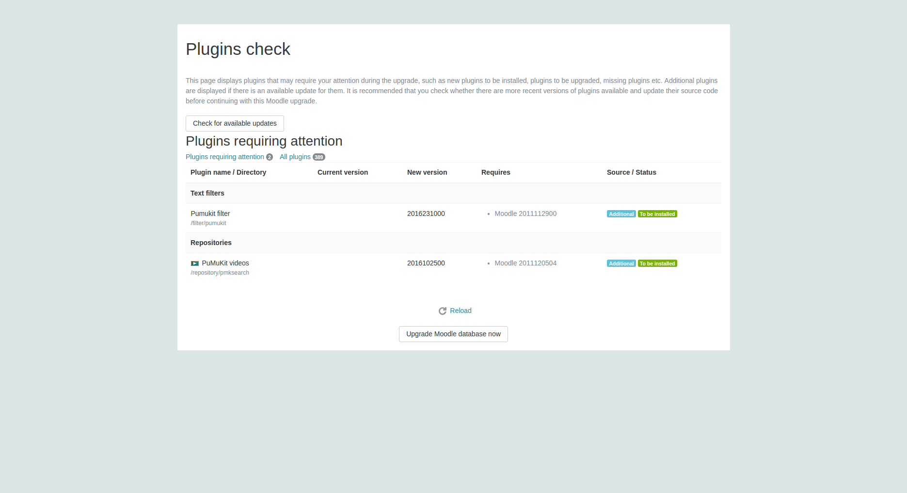
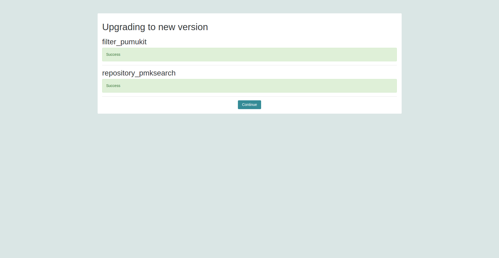
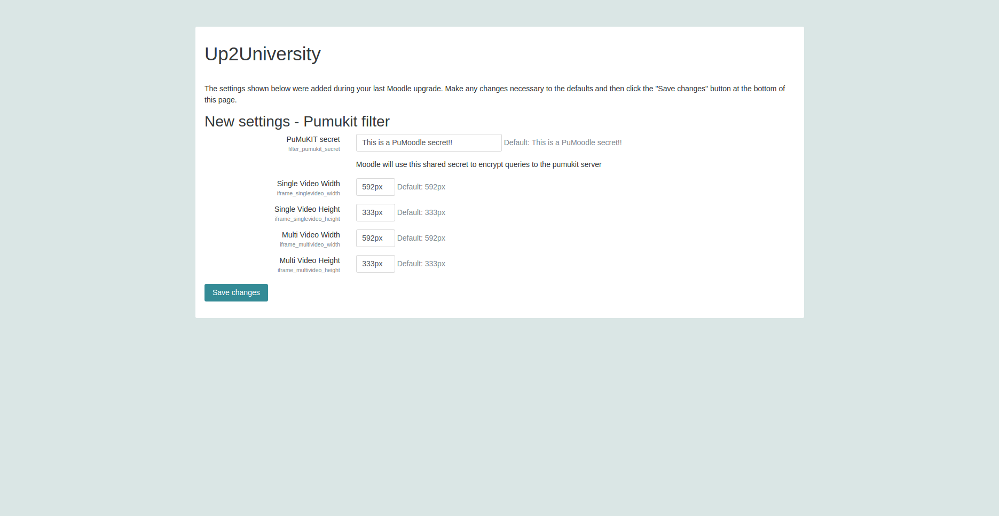
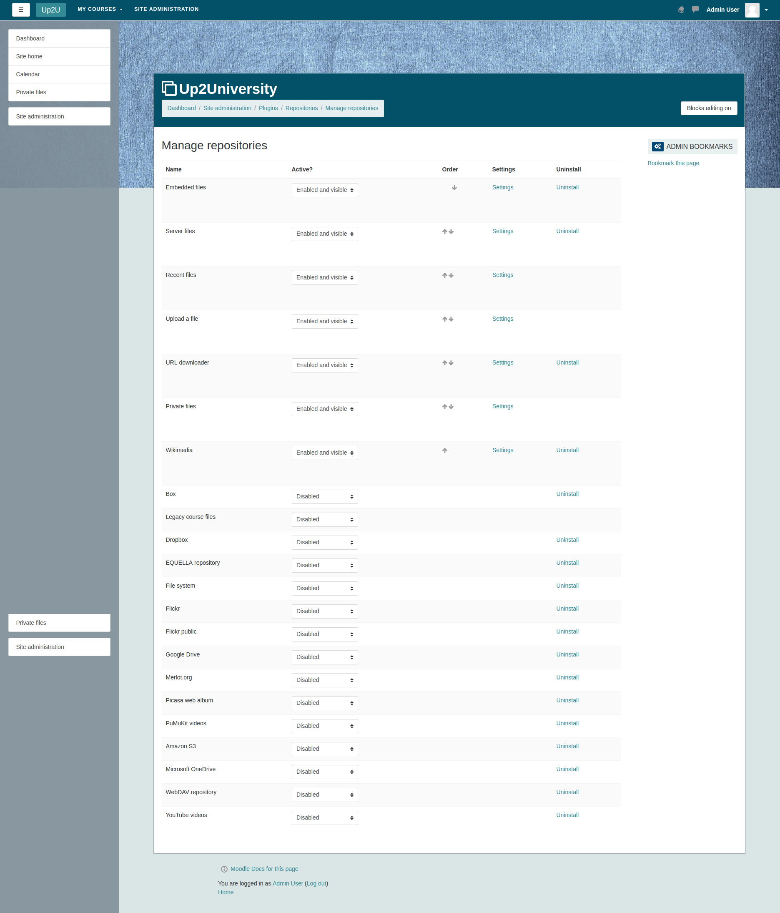
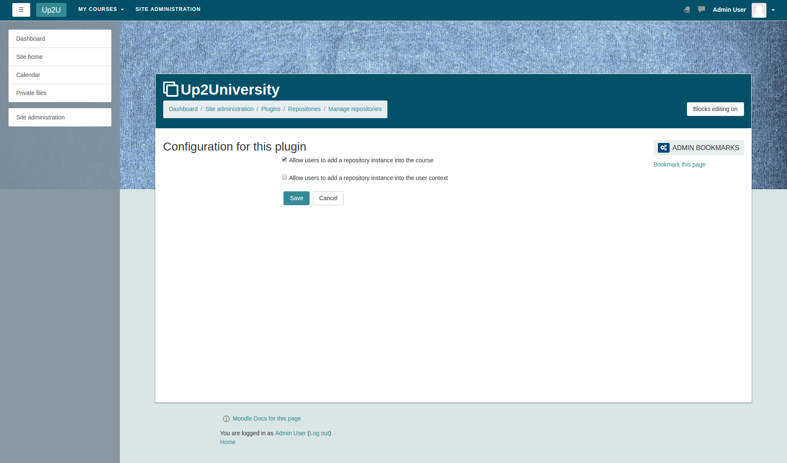
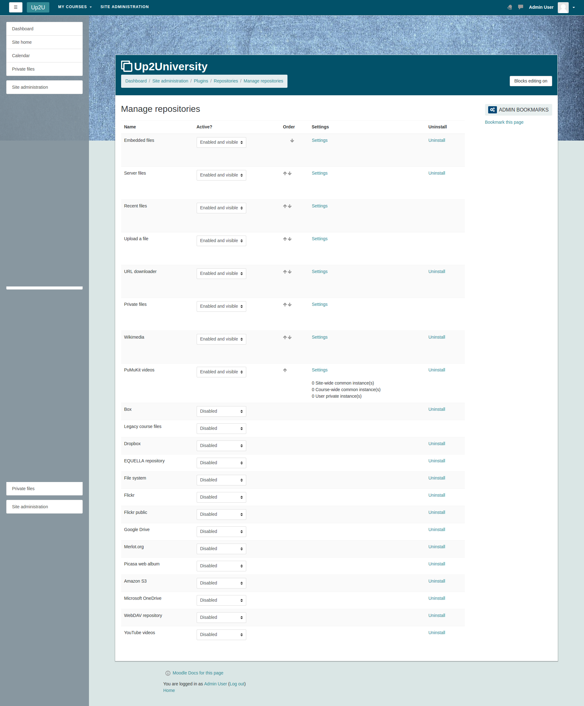
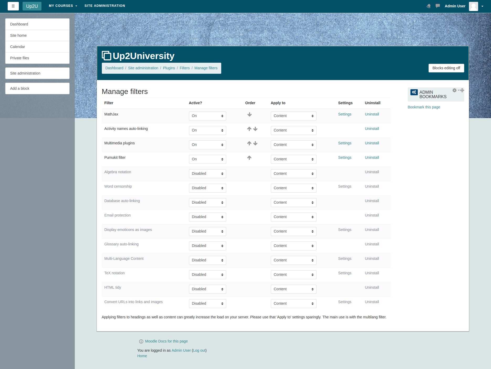
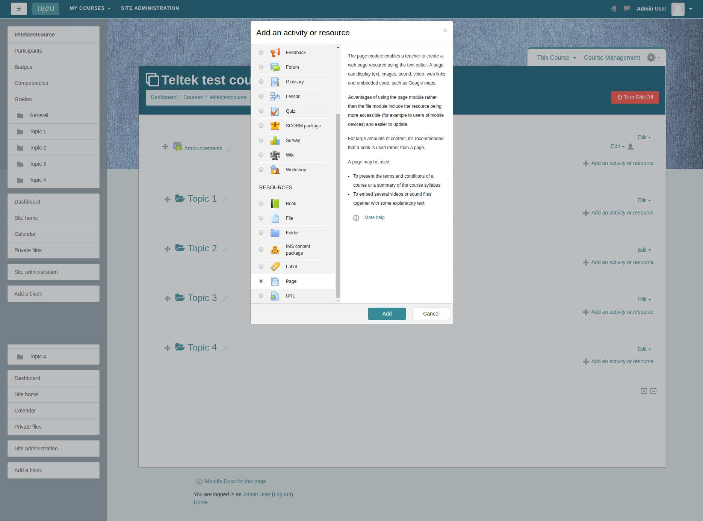
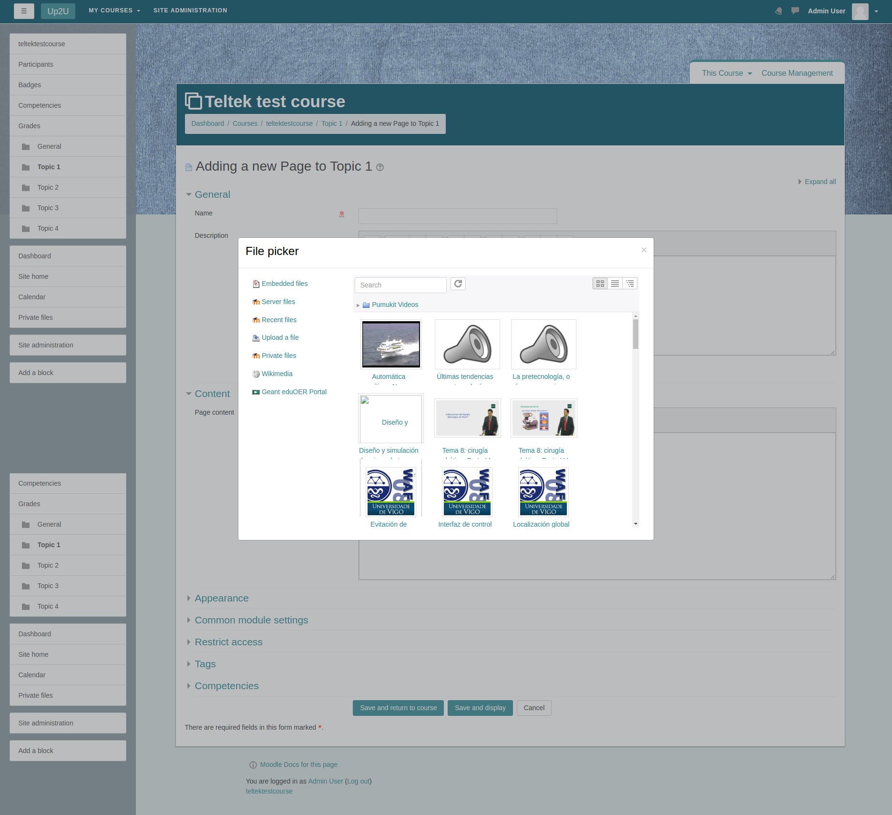
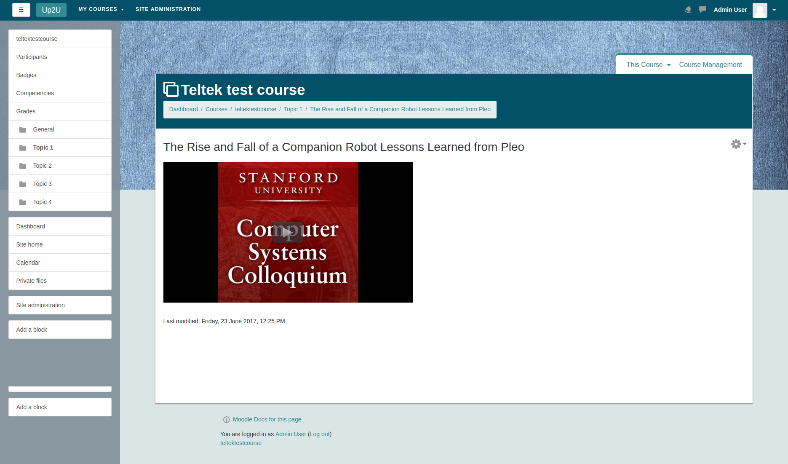

# Moodle Integration with eduOER

*Version: WIP*

## Upgrade Moodle database.

Plugins check.

Upgrading to new version.

Upgrade Pumukit filter settings.

## Enable repository

Manage repositories.

Config repository.

Manage repositories.

Create a new instance of the site.

Configure repository instance.

New repository instance configured.

## Enable filter

Active the PuMuKIT filter.

## Example
Add a new page into a course.

Insert media in the page

Use the new Pumukit repository and select a video

Play the video in the page.

